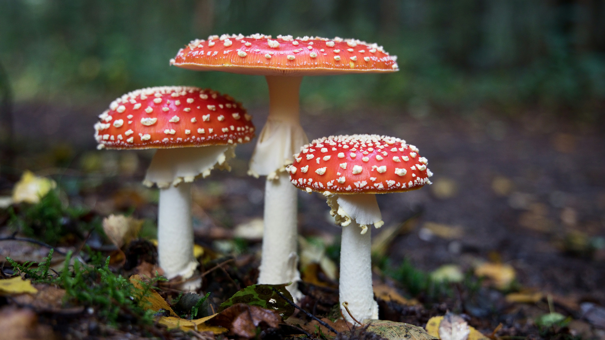

<p align="center">
  
</p>

# Omarchy Mushrooms Theme

An Omarchy theme for dark terminals and woodland color. Mushrooms keeps the desktop on black soil. Periwinkle marks the accent. Moss and terracotta come from the caps and stems.

## Install

```sh
omarchy-theme-install https://github.com/csfh/omarchy-mushrooms-theme
```

You can also install it from the Omarchy menu with `Super + Alt + Space`, then `Install > Style > Theme`, using this repository URL:

```text
https://github.com/csfh/omarchy-mushrooms-theme
```

## Palette

| Role | Hex |
| --- | --- |
| Background | `#121212` |
| Foreground | `#ffffff` |
| Accent | `#7675d2` |
| Red | `#e39a82` |
| Green | `#769b4b` |
| Yellow | `#8a9b4b` |
| Magenta | `#8b75d2` |
| Cyan | `#759b4b` |

## Included

Desktop, terminal, editor, launcher, notification, bar, lock screen, browser, Discord, and TUI theme files for Omarchy:

`alacritty`, `btop`, `chromium`, `foot`, `ghostty`, `gtk`, `hyprland`, `hyprlock`, `kitty`, `mako`, `neovim`, `swayosd`, `vencord`, `vscode`, `walker`, `warp`, `waybar`, `wofi`, and `zellij`.

## Backgrounds

The wallpapers are photographs on [Unsplash](https://unsplash.com), used under the [Unsplash License](https://unsplash.com/license):

- [`scarlet-caps`](backgrounds/scarlet-caps.jpg) by [Hans Veth](https://unsplash.com/@hans_veth) ([photo](https://unsplash.com/photos/red-mushrooms--Vp8y5L2fKg))
- [`bolete-bank`](backgrounds/bolete-bank.jpg) by [Kylli Kittus](https://unsplash.com/photos/brown-mushroom-on-green-grass-during-daytime-gtdyJQqCzsA)
- [`pale-cluster`](backgrounds/pale-cluster.jpg) by [Presetbase](https://unsplash.com/@presetbase) ([photo](https://unsplash.com/photos/selective-focus-photography-of-pink-mushrooms-QN6NkYi3CKs))

## License

MIT. See [LICENSE](LICENSE). Copyright (c) 2026 Christoffer Hallas.

Unsplash photographs remain the work of their authors under the Unsplash License.

If you send a pull request or other contribution, you agree to the [CLA](CLA.md).
